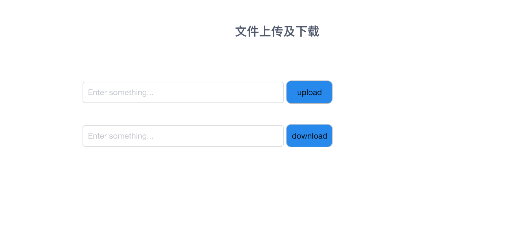

## Hadoop_File_Opt

目录结构
- Hadoop_File_Opt/
     - Hadoop_File_Opt/
         - Hadoop_File_Opt/
               -__pycache__	
               -__init__.py	
               -celery.py	
               -settings.py	
               -urls.py	iview	
               -wsgi.py
         - Operate
               __pycache__
               __init__.py	
               -admin.py		
               -apps.py	
               -models.py	
               -tasks.py	
               -views.py
         - static
         - templates/
               -index.html
         - db.sqlite3
         - manage.py
     - image
     - README.md


这是一个Django项目，运行之前启动hadoop和redis


* 使用celery对hadoop文件进行操作分为下面五个步骤：
    * Django搭建
    * iview前端页面
    * 搭建Hadoop环境
    * 使用python对Hadoop文件进行操作
    * 使用celery对文件进行操作

## Django搭建

创建一个Hadoop_File_Opt项目

```
django-admin startproject Hadoop_File_Opt
```

运行看是否创建成功

```
python3 manage.py runserver
```


再创建一个app

```
python3 manage.py startapp Operate
```

## 搭建hadoop
* Hadoop搭建步骤：
   * 安装配置jdk
   * 下载需要的版本到本地目录，解压到hadoop
   * 修改配置文件,切换到Hadoop/etc/hadoop下编辑修改hadoop-env.sh,core-site.xml,mapred-site.xml,hdfs-site.xml
   * 启动Hadoop，切换到/hadoop/sbin 先启动hdfs（start-dfs.sh）再启动yarn（start-yarn.sh）
   * 查看进程jps
   * 测试，切换到hadoop/bin 上传文件到Hadoop ./hadoop fs -copy-from-lcoal test.txt  /

启动Hadoop


## 用python对hdfs进行操作
使用到pyhdfs包

```
#读取hdfs上面的文件
client=HdfsClient(hosts='localhost:50070')#hdfs地址
res=client.open('/tmp/te/test1.txt')#hdfs文件路径,根目录/
for r in res:
    line=str(r,encoding='utf8')#open后是二进制,str()转换为字符串并转码
    print(line)
client.copy_from_local('test0.txt',‘/tmp/te/test3.txt')#本地文件绝对路径,HDFS目录必须不存在
client.copy_to_local('/tmp/te/test4.txt','./test2.txt')
```


## 前段界面

主要是两个form表单，输入上传或下载的文件名，将文件名传输到对应的地址，{{res_u}}接受Django返回的结果succeed/fail

```
<form action="/upload" method="POST">
      
      <i-formItem>
      <i-input name="q" v-model="up_value" placeholder="Enter something..." style="width: 300px" />
      </i-formItem>
      <button type="submit" style="height:35px;width:70px;background-color:#1C86EE;border-radius:8px;">upload</button>
  </form>
  <div style="color:red">{{ res_u }}</div>
  <form style="margin-top:30px" action="/download" method="POST">
      <i-formItem>
          <i-input name="q" v-model="down_value" placeholder="Enter something..." style="width: 300px" />
      </i-formItem>
      <button type="submit" style="height:35px;width:70px;background-color:#1C86EE;border-radius:8px;">download</button>
  </form>
<div style="color:red">{{ res_d }}</div>
</div>

```




使用表单的提交
## 本地调试celery

启动redis

```
 ./redis-server
```


```
from celery import Celery
from pyhdfs import HdfsClient 

app = Celery('task',
             broker='redis://localhost',
             backend='redis://localhost')
 #连接到redis
@app.task
def read():
    client=HdfsClient(hosts='localhost:50070')
    #连接到hdfs
    res=client.open('/tmp/te/test.txt')
    #读取文件
    for r in res:
        line=str(r,encoding='utf8')
        print(line)    
```

启动当前celery

```
celery -A task worker --loglevel=info
```


 在python中导入task运行
 
 结果
 


## celery的配置到Django

在工程目录下setting.py所在到目录中创建celery.py

``` 
os.environ.setdefault('DJANGO_SETTINGS_MODULE', 'Hadoop_File_Opt.settings')
#设置环境变量，让celery知道项目的环境变量 
app = Celery('Hadoop_File_Opt')
#配置Django，Hadoop_File_Opt为当前工程
project_name = os.path.split(os.path.abspath('.'))[-1]
project_settings = '%s.settings' % project_name
#获取当前文件夹名，即为该Django的项目名 
os.environ.setdefault('DJANGO_SETTINGS_MODULE', project_settings)
#设置环境变量
app = Celery(project_name)
#实例化Celery
app.config_from_object('django.conf:settings')
#使用django的settings文件配置celery
app.autodiscover_tasks(lambda: settings.INSTALLED_APPS)
#自动发现app里面的selery任务
```

在setting.py中添加

```
BROKER_URL = 'redis://localhost'
CELERY_RESULT_BACKEN = 'redis://localhost'
#用于配置redis
```

在app中view.py所在的目录下添加一个tasks.py文件

```
@shared_task
def Copy_From_Local(file):
    '''
    上传文件到hadoop
    '''
    h_file = ('/tmp/te/%s'%file)
    client=HdfsClient(hosts='localhost:50070')#hdfs地址，连接hdfs
    if client.exists(h_file):
        client.delete(h_file)
        #判断文件是否存在于hdfs，存在就删除
    client.copy_from_local(file,h_file)
    #从本地添加文件到hdfs
   
@shared_task
def Copy_To_Local(file):
    '''
    从Hadoop上下载文件
    '''
    client=HdfsClient(hosts='localhost:50070')#连接到hdfs
    if os.path.exists(file):
        os.remove(file)
        #判断本地是否存在文件，存在就删除
    client.copy_to_local(file,'./')
```

在view.py中添加两个方法

```
def UpLoad(request):
    '''
    文件上传
    '''
    message = {}
    client=HdfsClient(hosts='localhost:50070')
    #连接到hdfs
    file = request.POST['q']
    #接受网页提交的文件名
    h_file = ('/tmp/te/%s'%file)
    tasks.Copy_From_Local.delay(file)
    #使用celery上传文件
    if client.exists(h_file):
        message['res_u'] = 'UpLoad success'
    else:
        message['res_u'] = 'Upload fail'
    #判读是否上传成功，返回结果
    return render(request, "index.html",message)

def DownLoad(request):
    '''
    文件下载
    '''
    message = {}
    file = request.POST['q']
    #接受网页提交的文件名
    tasks.Copy_To_Local.delay(file)
    #使用celery下载文件
    if os.path.exists(file):
        message['res_d'] = 'Download success'
    else:
        message['res_d'] = 'Download fail'
    #判读是否下载成功，返回结果
    return render(request, "index.html",message)
```

在url.py中添加
```
 url(r'^download',views.DownLoad),
 url(r'upload',views.UpLoad),
```

启动celery
切换到manage.py所在的目录，输入下面命令

```
celery -A Hadoop_File_Opt worker -l info
```
在第一个输入框中输入要提交的本地文件路径（可以在file添加一个固定路径，输入文件名），点击按钮，文件提交到hdfs的/tmp/te/
在第二个输入框输入要瞎子到本地的文件名，点击按钮，文件从/tmp/te/下载到当前目录./（可以指定其他目录）
